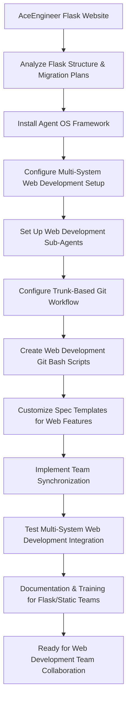

# Spec Requirements Document

> Spec: Agent OS Integration for AceEngineer Website
> Created: 2025-07-30
> Status: Planning

## Executive Summary

**Prompt for Future Reuse:**
```
Set up buildermethods Agent OS (https://github.com/buildermethods/agent-os) for this Flask-based marketing website with comprehensive team collaboration features. Execute the following implementation with logical task dependency ordering:

TASK DEPENDENCY ORDERING STANDARD:
- All implementation tasks must follow logical dependency ordering where prior tasks are always applicable (if logical) to subsequent tasks
- Each task builds upon the achievements of previous tasks
- Task dependencies must be explicitly documented
- Foundation tasks (like system installation) come before dependent tasks (like analysis or configuration)
- This ordering minimizes errors, reduces rework, and ensures consistent implementation success across different team members and environments

IMPLEMENTATION STEPS:

1. INSTALL AGENT OS WITH MULTI-SYSTEM CONFIGURATION:
   Prerequisites: None - Foundation task
   - Install the framework at system level for Windows, Linux, macOS, or Unix
   - Configure system-level paths, environment variables, and shell integration
   - Set up cross-platform compatibility and OS-specific shell integration
   - Validate system installation with cross-platform compatibility tests

2. ANALYZE EXISTING FLASK WEBSITE:
   Depends on: Task 1 - System installation required to run @analyze-product
   - Run: @analyze-product "I want to install Agent OS in this existing Flask marketing website"
   - Document current Flask structure, static migration plans, and development workflow
   - Identify integration points for the framework with Flask-to-static migration context
   - Create comprehensive analysis report for marketing website repository integration

3. REPOSITORY INTEGRATION AND CONFIGURATION:
   Depends on: Task 2 - Analysis results guide repository configuration
   - Install and configure the framework in this Flask website repository based on analysis results
   - Create .agent-os directory structure with sub-agents folder for web development workflow
   - Configure repository-level settings for multi-system team synchronization with Flask/static context
   - Always use /create-spec for specs and user stories related to web development

4. PROJECT SUB-AGENTS CONFIGURATION:
   Depends on: Task 3 - Repository structure and settings required for sub-agents
   - development-agent.md: Flask development and static site generation workflows for this marketing website
   - testing-agent.md: Automated testing for Flask routes and static site validation using web testing approaches
   - deployment-agent.md: GitHub Pages deployment automation and Flask-to-static build process
   - Configure sub-agents for cross-system synchronization with web development focus

5. TRUNK-BASED GIT DEVELOPMENT WORKFLOW:
   Depends on: Task 4 - Sub-agents provide the automation foundation for git workflows
   - Configure trunk-based git development workflow for each spec with web development context
   - Set up automated branching and merge workflows for Flask and static site features
   - Implement feature flags for continuous integration support with web deployment pipeline

6. OS-SPECIFIC GIT BASH AUTOMATION SCRIPTS:
   Depends on: Task 5 - Git workflow structure required before creating automation scripts
   - create-spec-branch.sh: Automated spec branch management for web development features
   - sync-team-state.sh: Cross-system project synchronization for Flask/static development
   - merge-spec-completion.sh: Automated spec completion workflows for web features
   - Create OS-specific versions for Windows PowerShell, Linux/Unix bash, and macOS zsh/bash
   - development-tasks.sh: Common web development task automation (Flask dev server, static build, etc.)

7. ENHANCED SPEC TEMPLATES:
   Depends on: Task 6 - Automation scripts inform template workflow integration
   - Store all specs in .agent-os/specs/ folder with date-based naming for web features
   - Include executive summary in every spec with original prompt and mermaid flowcharts for web workflows
   - Modify spec templates to include reusable prompt capture for marketing website development
   - Ensure prompt completeness and self-containment for any web development team

8. TEAM SYNCHRONIZATION FEATURES:
   Depends on: Task 7 - Templates and workflows must be established before team synchronization
   - Configure project-level and user-level settings for Flask/static development teams
   - Implement cross-system state synchronization for web development environments
   - Enable consistent behavior across different development environments with Flask and static site context
   - Support distributed team collaboration with trunk-based development for marketing website

9. TESTING AND VALIDATION:
   Depends on: Task 8 - All components must be implemented before comprehensive testing
   - Write comprehensive tests for system-level installation across all supported operating systems
   - Test OS-specific installation scenarios (Windows, Linux, macOS, Unix) with web development tools
   - Test complete multi-system workflow from spec creation to completion for Flask/static features
   - Validate team synchronization and sub-agent functionality across different web development environments

10. DOCUMENTATION AND TEAM TRAINING:
    Depends on: Task 9 - System must be tested and validated before documentation and training
    - Document system-level installation procedures for all supported operating systems with web development context
    - Update documentation with comprehensive workflow instructions for this Flask marketing website
    - Create team training documentation for new trunk-based development workflow with Flask/static migration focus
    - Provide multi-system setup guide for distributed web development team members
    - Create reusable implementation guide that can be applied to other Flask/web repositories

DELIVERABLES:
- Fully integrated Agent OS system with multi-platform support for Flask/static web development
- Custom spec templates with executive summaries and mermaid flowcharts for web development workflows
- Cross-platform git bash automation scripts optimized for Flask and static site development
- Multi-system team synchronization capabilities for web development teams
- Comprehensive documentation and training materials for Flask-to-static migration workflows
- Established task dependency ordering framework for future web development implementations

This setup enables your web development team to use Agent OS for structured, synchronized, and automated development workflows across multiple systems and team members with logical task dependencies that ensure implementation success for Flask applications and static site migrations.
```

**Process Flow:**


## Overview

Integrate Agent OS development framework into this Flask-based marketing website repository to enable multi-system team collaboration with trunk-based development, automated git bash workflows, and synchronized sub-agents. This integration will provide structured spec creation, task management, and standardized documentation processes optimized for distributed web development teams working on Flask applications and static site migrations.

## User Stories

### Multi-System Web Development Team Collaboration

As a web developer working on this Flask marketing website across multiple systems, I want to use Agent OS with trunk-based development and automated git bash scripts, so that I can collaborate seamlessly with team members while maintaining consistent workflows and synchronized states for both Flask development and static site migration tasks.

**Detailed Workflow:**
1. Developer creates new web feature spec using `/create-spec` command
2. The system automatically creates trunk-based git branch for this web development spec
3. Sub-agents are configured in .agent-os folder for web development team synchronization
4. Git bash scripts automate Flask development tasks, static site generation, and deployment
5. All team members work on main branch with feature flags and continuous integration for web features
6. Spec completion automatically merges changes and updates the Flask/static site state

### System-Level Agent OS Installation for Web Development

As a web development team member setting up this Flask project on my system, I want Agent OS to be properly installed at the system level for my operating system, so that I can use the framework consistently for Flask development and static site work regardless of whether I'm on Windows, Linux, macOS, or Unix, with all commands and tools properly configured for web development environments.

**Detailed Workflow:**
1. System detects current operating system (Windows, Linux, macOS, Unix)
2. Downloads and installs appropriate Agent OS system components for the OS with web development support
3. Configures system-level paths, environment variables, and shell integration for Flask development
4. Sets up OS-specific git bash environment and permissions for web development workflows
5. Validates installation with cross-platform compatibility tests including Flask and static site tools
6. Enables seamless `/create-spec` and other Agent OS commands for web development features

### Flask-to-Static Migration Management

As a manager of this Flask marketing website project, I want Agent OS to provide multi-system synchronization with standardized spec creation for both Flask features and static site migration tasks, so that distributed team members can work consistently on web development regardless of their development environment while maintaining full traceability of marketing website requirements and technical decisions.

**Detailed Workflow:**
1. Team member creates web development spec using standardized `/create-spec` process
2. Executive summary captures original prompt for future reference in web development context
3. Mermaid flowcharts visualize web development process flows and Flask-to-static migration workflows
4. Sub-agents ensure consistent behavior across all team systems for Flask and static site development
5. Trunk-based development enables continuous integration without branch conflicts for web features
6. Git bash automation handles routine Flask development, static site generation, and GitHub Pages deployment tasks

## Spec Scope

1. **Task Dependency Ordering Requirement** - All implementation tasks must follow logical dependency ordering where prior tasks are always applicable (if logical) to subsequent tasks, ensuring each step builds upon previous achievements for web development workflows
2. **System-Level Agent OS Installation** - Install and configure the framework at system level for Windows, Linux, macOS, and Unix environments with web development tool support
3. **Repository Integration** - Install and configure the framework in this Flask marketing website repository using @analyze-product approach (depends on system installation)
4. **Web Development Sub-Agents Configuration** - Set up repository sub-agents in .agent-os folder for team synchronization using Flask development and static site migration technology stack (depends on repository integration)
5. **Trunk-Based Git Development** - Configure trunk-based development workflow for each spec with automated branching for web development features (depends on sub-agents)
6. **Cross-Platform Web Development Git Bash Automation** - Create OS-specific git bash scripts for Flask development, static site generation, testing, and GitHub Pages deployment (depends on git workflow)
7. **Multi-System Team Synchronization** - Implement system-level configurations for consistent team collaboration across different operating systems for web development (depends on automation scripts)
8. **Enhanced Spec Templates** - Modify templates to include executive summary with prompt capture and mermaid diagrams for web development workflows (depends on synchronization setup)

## Out of Scope

- Modification of existing Flask application functionality or business logic
- Changes to the current Flask-to-static migration roadmap or timeline
- Integration with external marketing tools beyond Agent OS
- Custom features beyond the specified Agent OS customizations
- Flask-specific implementations (the solution should work with current Flask stack and planned static migration)

## Expected Deliverable

1. **Fully Integrated System** - Agent OS framework successfully installed and configured in this Flask marketing website repository
2. **Custom Web Development Spec Templates** - Modified templates that automatically include executive summary sections with reusable prompts and mermaid flowcharts for Flask and static site workflows
3. **Updated Web Development Workflow** - Team can use `/create-spec` command to generate structured specifications that work with Flask development and static site migration technology stack
4. **Logical Task Dependency Framework** - Established pattern of task ordering where each step builds upon previous achievements for maximum efficiency and reduced errors in web development
5. **Reusable Implementation Guide** - Complete documentation that enables this setup to be replicated in other Flask or web development repositories

## Future Spec Requirements

**Executive Summary Prompt Completeness Standard**: All specs created using Agent OS must include a complete, self-contained "Prompt for Future Reuse" in the executive summary that:
- Contains all necessary information for any web development project team to implement without external references
- Includes the Task Dependency Ordering Standard as defined below
- Documents all implementation steps with explicit dependencies for Flask/static development
- Lists all expected deliverables and outcomes for web development workflows
- Uses generic language (pronouns, common nouns) for repository adaptability across web projects
- Provides sufficient context for successful implementation across different web development environments

**Task Dependency Ordering Standard**: All future specs created using Agent OS must follow the logical dependency ordering principle established in this specification, where:
- Prior tasks are always applicable (if logical) to subsequent tasks in web development workflows
- Each task builds upon the achievements of previous tasks for Flask and static site development
- Task dependencies are explicitly documented in both the prompt and task sections
- Foundation tasks (like system installation) come before dependent tasks (like Flask configuration or static site generation)
- This ordering minimizes errors, reduces rework, and ensures consistent implementation success across different web development team members and environments

## Spec Documentation

- Tasks: @.agent-os/specs/2025-07-30-agent-os-integration/tasks.md
- Technical Specification: @.agent-os/specs/2025-07-30-agent-os-integration/sub-specs/technical-spec.md
- Tests Specification: @.agent-os/specs/2025-07-30-agent-os-integration/sub-specs/tests.md